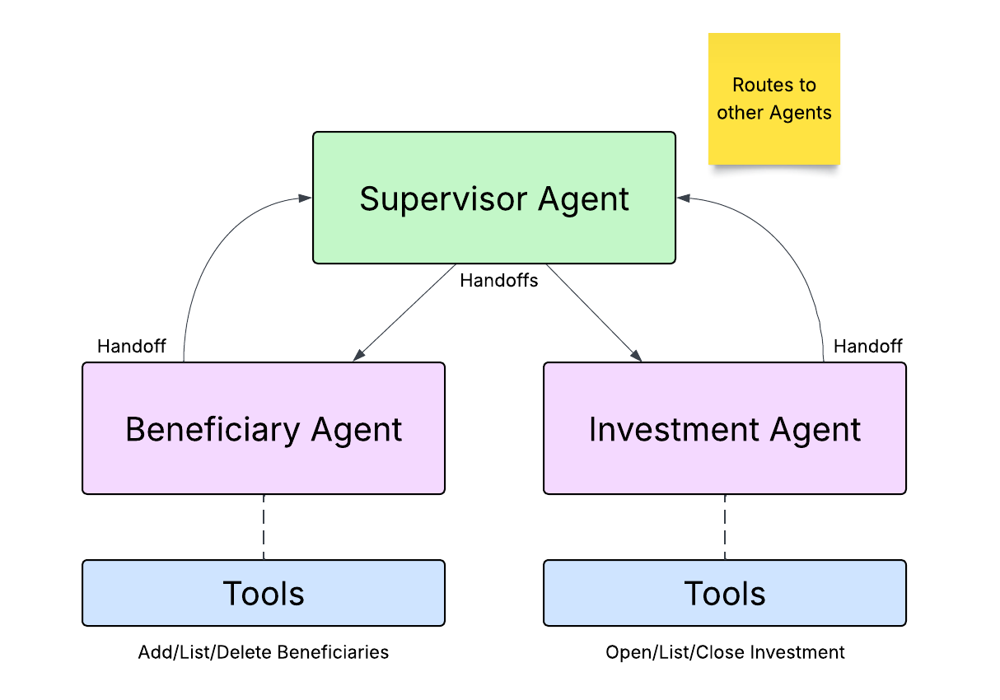

# Wealth Management Agent Example using OpenAI Agents SDK
Demonstrates how to use [OpenAI Agents SDK](https://openai.github.io/openai-agents-python/) using handoffs to other agents. 
Shows an example of just using OpenAI Agents SDK and another version that leverages [Temporal](https://temporal.io) to 
wrap the agentic flow with Temporal.



The vanilla OpenAI Agents SDK version of this example is located [here](src/oai_supervisor/README.md).
The Temporal version of this example is located [here](src/temporal_supervisor/README.md).

Scenarios currently implemented include
* Add Beneficiary - add a new beneficiary to your account
* List Beneficiaries - shows a list of beneficiaries and their relationship to the account owner
* Delete Beneficiary - delete a beneficiary from your account
* Open Investment Account - opens a new investment account - using a **child workflow** in the Temporal version. 
* List Investments - shows a list of accounts and their current balances
* Close Investment Account - closes an investment account

There are two ways to run through the scenarios with the Temporal version
* Using a [Web Application](src/frontend/README.md) or 
* Using a [Console Application](src/temporal_supervisor/README.md)

## Prerequisites

* [Poetry](https://python-poetry.org/docs/) - Python Dependency Management
* [OpenAI API Key] (https://platform.openai.com/api-keys) - Your key to accessing OpenAI's LLM
* [Temporal CLI](https://docs.temporal.io/cli#install) - Local Temporal service
* [Redis](https://redis.io/downloads/) - Workflow writes conversation history, API reads from it

## Set up Python Environment
```bash
poetry install
```

## Set up your OpenAI API Key
 
```bash
cp setoaikey.example setoaikey.sh
chmod +x setoaikey.sh
```

Now edit the setoaikey.sh file and paste in your OpenAI API Key.
It should look something like this:
```text
export OPENAI_API_KEY=sk-proj-....
```

See the OpenAI Agents SDK Version [here](src/oai_supervisor/README.md)
And the Temporal version of this example is located [here](src/temporal_supervisor/README.md)
