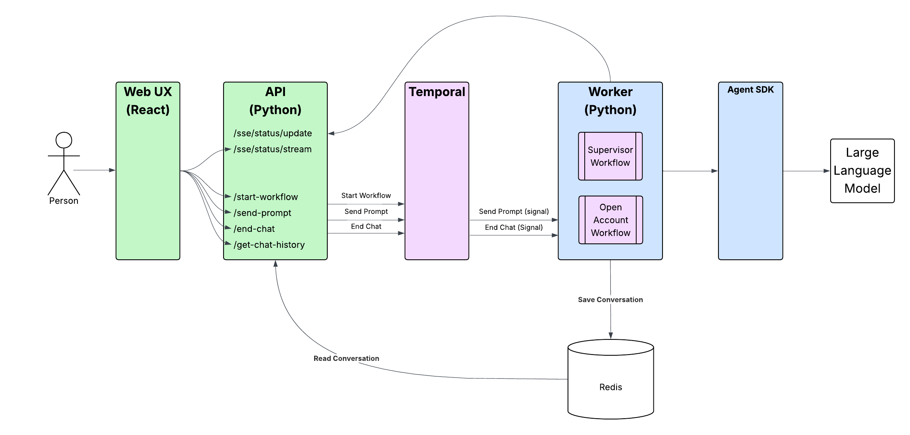
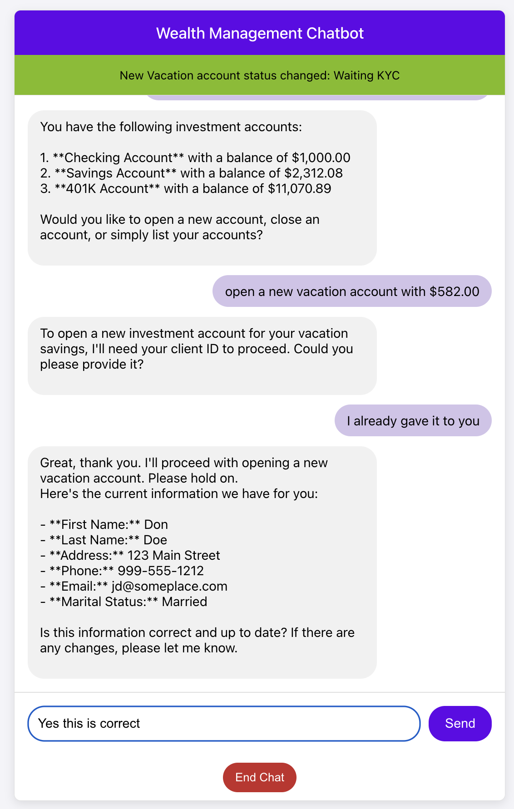
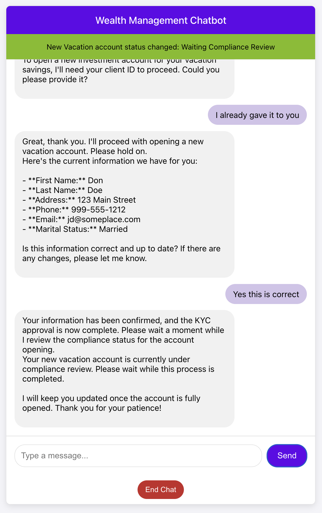
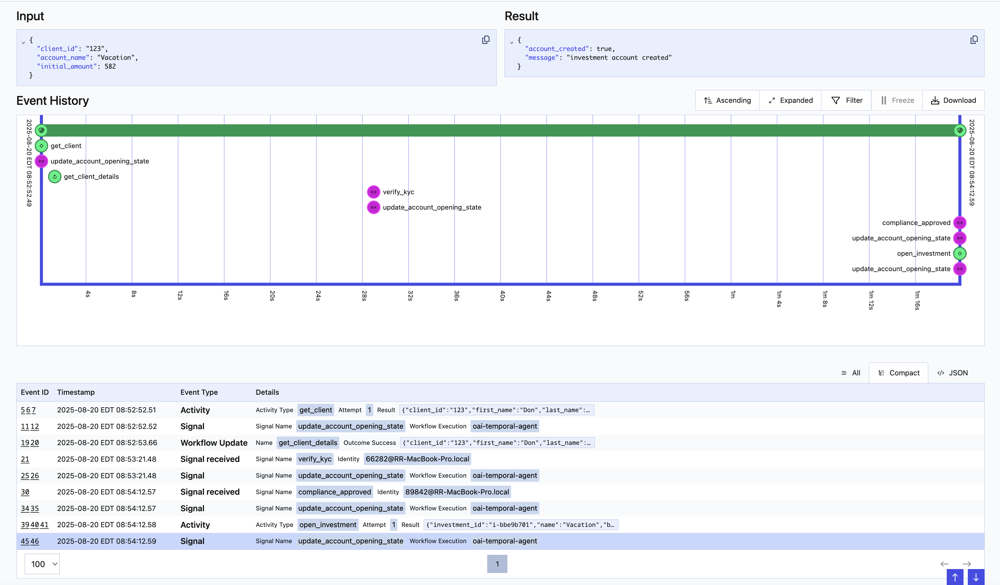

# Wealth Management Agent Example using OpenAI Agents SDK
Demonstrates how to use OpenAI Agents with Temporal. It demonstrates how to use handoffs to other agents. 
The supervisor agent is responsible for directing the actions to the appropriate helper agents.   

Scenarios currently implemented include
* Add Beneficiary - add a new beneficiary to your account
* List Beneficiaries - shows a list of beneficiaries and their relationship to the account owner
* Delete Beneficiary - delete a beneficiary from your account
* Open Investment Account - opens a new investment account using a **Child Workflow**
* List Investments - shows a list of accounts and their current balances
* Close Investment Account - closes an investment account

## Application Architecture

The overall application architecture looks like this:



There is a React UX which is where the customer interacts with the application. 
The React UX leverages an API which exposes endpoints to start a workflow, send a prompt,
retrieving the chat history, and ending the chat. The React frontend uses adaptive polling
to retrieve new events from Redis, providing real-time status updates as the Open Account 
child workflow progresses through the different steps. 

The API in turn, communicates with Temporal to start workflows and send signals. Finally, 
the worker contains the two workflows - supervisor and open account - which contain the 
agents and business logic that drive the agentic application.


## Prerequisites

* [Poetry](https://python-poetry.org/docs/) - Python Dependency Management
* [Redis](https://redis.io/downloads/) - Stores conversation history and status updates 

## Set up Python Environment
```bash
poetry install
```

## Set up your OpenAI API Key
 
```bash
cp setoaikey.example setoaikey.sh
chmod +x setoaikey.sh
```

Now edit the setoaikey.sh file and paste in your OpenAI API Key.
It should look something like this:
```bash
export OPENAI_API_KEY=sk-proj-....
```
## Set up Redis

Redis is used for storing conversation history and providing real-time status updates. If you don't have an existing Redis server, you can run one locally after installing it. 

In a new terminal / shell run the following command:

```bash
redis-server
```

By default, the application expects to find Redis running locally. You can override the location of Redis
by setting the environment variables:

```bash
export REDIS_HOST=localhost
export REDIS_PORT=6379
```

## Set up Claim Check (optional)

An optional configuration is to substitute the data sent to Temporal (e.g. function/method parameters and return values)
with an ID. This is known as the [Claim Check Pattern](https://www.enterpriseintegrationpatterns.com/patterns/messaging/StoreInLibrary.html). 
The original data is stored in Redis. This uses a 
[Custom Payload Codec](https://docs.temporal.io/develop/python/converters-and-encryption#custom-payload-codec) 
that intercepts data going to Temporal Cloud, replaces it with a GUID. When the data is retrieved, it looks up the GUID 
replaces it with the data stored in Redis.

```bash
cp setclaimcheck.example setclaimcheck.sh
chmod +x setclaimcheck.sh
```

Now edit the setclaimcheck.sh file and fill in the location of Redis
It should look something like this:
```bash
export USE_CLAIM_CHECK=true
export REDIS_HOST=localhost
export REDIS_PORT=6379
```

Save the file and be sure that you have Redis running. For example:

```bash
redis-server
```

Note that the application assumes you only have one Redis server that is used by the application for storing the 
conversation history and is also used if Claim Check has been enabled. 

Be aware that using a claim check pattern introduces performance costs by doing remote calls to Redis for every payload. 
Also, make sure your Redis implementation is rock solid as any downtime will directly affect your workflows. 

## Run Codec Server for Claim Check (optional)
If you have decided to set up the Claim Check above, you will 
most likely want to also run a Codec Server to be able to see the actual sent to 
the workflow and activities. 

Be sure you have updated the setclaimcheck.sh as mentioned above.

To run the Codec Server:
```bash
./startcodecserver.sh
```

And of course, make sure that your Redis Server is up and running. 

Once it's up and running, the default endpoint is http://127.0.0.1:8081.

Open up your browser and navigate to the Temporal UI. Locally that is usually localhost:8233. 
For Temporal Cloud that will be https://cloud.temporal.io

In the upper right, there is an icon that looks like glasses. Click on that and you 
can configure your codec server. 

Change the drop down to "Use my browser setting and ignore Cluster-level setting".

Use the endpoint of your codec server (default is http://127.0.0.1:8081). Be sure there are no 
extra spaces at the end of the URL or it will not work. You can turn off the two options - Pass the 
user access token and Include cross-origin credentials. Click on apply and you have configured 
the codec server. 


As you run through different scenarios, you'll be able to see the decoded values in the browser.


If you remove the codec server settings, you won't be able to see anything other than a BASE64 Encoded ID.


## Running the Demo Locally
Start Temporal Locally.

```bash
temporal server start-dev
```

### Start the Worker

```bash
cd src/temporal_supervisor
./startlocalworker.sh
```

### Start the API

```bash
cd src/temporal_supervisor/api
./startlocalapi.sh
```
### Start the UX

```bash
cd src/temporal_supervisor/frontend
npm start
```

A new browser window opens where you can interact with the application. 

If you are opening a new investment account, in another terminal
### Send the Compliance Reviewed Signal 
```bash
cd src/temporal_supervisor
./localsendcomplianceapproval.sh <Child Workflow ID>
```

## Running the Demo in Temporal Cloud

Copy the setcloudenv.example, located in the src/temporal_supervisor folder to the project root and name it setcloudenv.sh .

```bash
cp  src/temporal_supervisor/setcloudenv.example setcloudenv.sh
```

Edit setcloudenv.sh to match your Temporal Cloud account:
```bash
export TEMPORAL_ADDRESS=<namespace>.<accountID>.tmprl.cloud:7233
export TEMPORAL_NAMESPACE=<namespace>.<accountID>
export TEMPORAL_TLS_CLIENT_CERT_PATH="/path/to/cert.pem"
export TEMPORAL_TLS_CLIENT_KEY_PATH="/path/to/key.key"
```

### Start the Worker
```bash
cd src/temporal_supervisor
./startcloudworker.sh
```

### Start the API

```bash
cd src/temporal_supervisor/api
./startcloudapi.sh
```
### Start the UX

```bash
cd src/temporal_supervisor/frontend
npm start
```

If you are opening a new investment account, in another terminal
### Send the Compliance Reviewed Signal 
```bash
cd src/temporal_supervisor
./cloudsendcomplianceapproval.sh <Child Workflow ID>
```

Here are a few screenshots of the UX while opening a new account.

Waiting for KYC to be confirmed:


Waiting for the Compliance Review to be done:


New account is complete and opened:


You can also add and delete beneficiaries.

Here is a sample event history shown in the Temporal UX


And here is a sample event history for the Open Account workflow in the Temporal UX:



## How the Open Account functionality works
To demonstrate how to integrate other workflows within an Agentic system, when a user
wants to open a new investment account, a child workflow (OpenInvestmentAccountWorkflow) is created. There is a special Open Account Agent
which is designed specifically to create and interact with the OpenInvestmentAccountWorkflow. 
This agent uses a @function_tool function that is responsible for creating the child workflow. 
Remember that @function_tool functions run in the context of the workflow, which means we can 
establish the parent/child relationship using the 

    `workflow.start_child_workflow()` 

All other tools are activities that provide the ability to retrieve information and 
the current state of the child workflow along with sending information to the workflow

One important thing to remember is to be sure you don't ask the agent to repeatedly 
poll the workflow as it will most likely result in a Max Turns exceeded exception. It is 
possible to change the value of Max Turns as a parameter to `Runner.Run`, just be very careful. 

