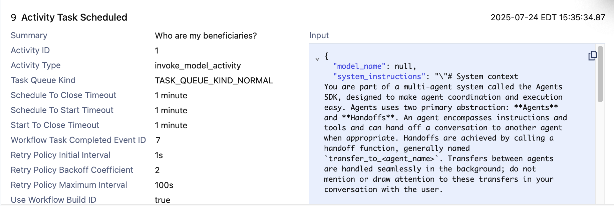
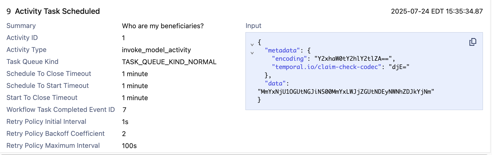
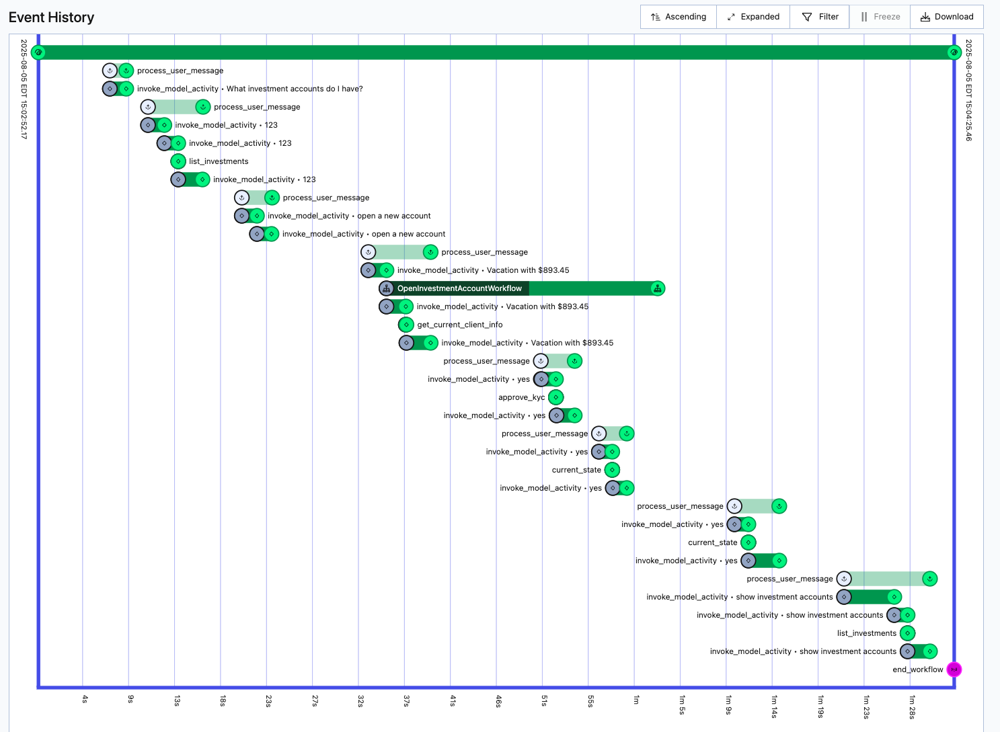
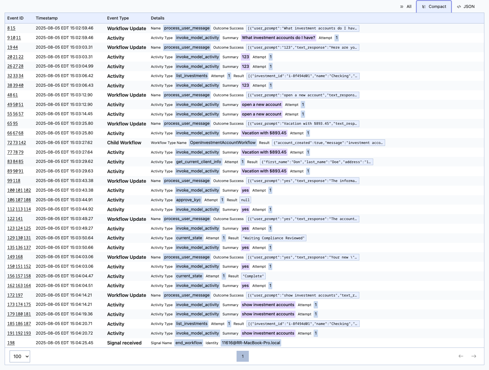

# Wealth Management Agent Example using OpenAI Agents SDK
Demonstrates how to use OpenAI Agents with Temporal. It demonstrates how to use handoffs to other agents. 
The supervisor agent is responsible for directing the actions to the appropriate helper agents.   

Scenarios currently implemented include
* Add Beneficiary - add a new beneficiary to your account
* List Beneficiaries - shows a list of beneficiaries and their relationship to the account owner
* Delete Beneficiary - delete a beneficiary from your account
* Open Investment Account - opens a new investment account using a **Child Workflow**
* List Investments - shows a list of accounts and their current balances
* Close Investment Account - closes an investment account

## Prerequisites

* [Poetry](https://python-poetry.org/docs/) - Python Dependency Management
* [Redis](https://redis.io/downloads/) - Redis - Optional. Only needed if you want to use the Claim Check pattern. 

## Set up Python Environment
```bash
poetry install
```

## Set up your OpenAI API Key
 
```bash
cp setoaikey.example setoaikey.sh
chmod +x setoaikey.sh
```

Now edit the setoaikey.sh file and paste in your OpenAI API Key.
It should look something like this:
```bash
export OPENAI_API_KEY=sk-proj-....
```

## Set up Claim Check / Redis (optional)

An optional configuration is to substitute the data sent to Temporal (e.g. function/method parameters and return values)
with an ID. This is known as the [Claim Check Pattern](https://www.enterpriseintegrationpatterns.com/patterns/messaging/StoreInLibrary.html). 
The original data is stored in Redis. This uses a 
[Custom Payload Codec](https://docs.temporal.io/develop/python/converters-and-encryption#custom-payload-codec) 
that intercepts data going to Temporal Cloud, replaces it with a GUID. When the data is retrieved, it looks up the GUID 
replaces it with the data stored in Redis.

```bash
cp setclaimcheck.example setclaimcheck.sh
chmod +x setclaimcheck.sh
```

Now edit the setclaimcheck.sh file and fill in the location of Redis
It should look something like this:
```bash
export USE_CLAIM_CHECK=true
export REDIS_HOST=localhost
export REDIS_PORT=6379
```

Save the file and be sure that you have Redis running. 

## Run Codec Server for Claim Check (optional)
If you have decided to set up the Claim Check above, you will 
most likely want to also run a Codec Server to be able to see the actual sent to 
the workflow and activities. 

Be sure you have updated the setclaimcheck.sh as mentioned above.

To run the Codec Server:
```bash
./startcodecserver.sh
```

And of course, make sure that your Redis Server is up and running. 

Once it's up and running, the default endpoint is http://127.0.0.1:8081.

Open up your browser and navigate to the Temporal UI. Locally that is usually localhost:8233. 
For Temporal Cloud that will be https://cloud.temporal.io

In the upper right, there is an icon that looks like glasses. Click on that and you 
can configure your codec server. 

Change the drop down to "Use my browser setting and ignore Cluster-level setting".

Use the endpoint of your codec server (default is http://127.0.0.1:8081). Be sure there are no 
extra spaces at the end of the URL or it will not work. You can turn off the two options - Pass the 
user access token and Include cross-origin credentials. Click on apply and you have configured 
the codec server. 


As you run through different scenarios, you'll be able to see the decoded values in the browser.



If you remove the codec server settings, you won't be able to see anything other than a BASE64 Encoded ID.



## Running the Demo Locally
Start Temporal Locally.

```bash
temporal server start-dev
```

### Start the Worker
This assumes you are already in the src/temporal_supervisor folder. 
```bash
cd src/temporal_supervisor
./startlocalworker.sh
```

In another terminal, start the Console UX
### Start the Command Line UX
```bash
cd src/temporal_supervisor
./startlocalux.sh
```

If you are opening a new investment account, in another terminal
### Send the Compliance Reviewed Signal 
```bash
cd src/temporal_supervisor
./localsendcomplianceapproval.sh <Child Workflow ID>
```

## Running the Demo in Temporal Cloud

Copy the setcloudenv.example to setcloudenv.sh in the src/temporal_supervisor folder.

```bash
cp setcloundenv.sh setcloudenv.sh
```

Edit setcloudenv.sh to match your Temporal Cloud account:
```bash
export TEMPORAL_ADDRESS=<namespace>.<accountID>.tmprl.cloud:7233
export TEMPORAL_NAMESPACE=<namespace>.<accountID>
export TEMPORAL_CERT_PATH="/path/to/cert.pem"
export TEMPORAL_KEY_PATH="/path/to/key.key"
```

### Start the Worker
```bash
cd src/temporal_supervisor
./startcloudworker.sh
```
In a new terminal, run the the UX, passing in a Workflow ID 

### Start the Console UX
```bash
cd src/temporal_supervisor
./startcloudux.sh <Workflow ID>
```

If you are opening a new investment account, in another terminal
### Send the Compliance Reviewed Signal 
```bash
cd src/temporal_supervisor
./cloudsendcomplianceapproval.sh <Child Workflow ID>
```


Example output:
```text
******* Skip OpenAI Plugin? True *******
address is 127.0.0.1:7233
Checking to see if the workflow is already running...
Got NOT FOUND. Will start it
Starting workflow using mycoolagent9

Welcome to ABC Wealth Management. How can I help you?
Enter your message: What investment accounts do I have?
Could you please provide your client ID so I can assist you with your investment accounts?

Enter your message: 123
Here are your investment accounts and their balances:

1. **Checking**: $1,000.00
2. **Savings**: $2,312.08
3. **401K**: $11,070.89

Would you like to open a new account, close an existing one, or see this list again?

Enter your message: open a new account
Could you please provide the name you would like for the new account and the initial amount for the deposit?

Enter your message: Vacation with $893.45
Here is your current information:

- **First Name**: Don
- **Last Name**: Doe
- **Address**: 123 Main Street
- **Phone**: 999-555-1212
- **Email**: jd@someplace.com
- **Marital Status**: Married

Is this information correct and up to date?

Enter your message: yes
The information has been approved. Would you like me to check the status of your account opening process?

Enter your message: yes
The account opening process is currently in the "Waiting Compliance Reviewed" stage. Would you like me to check the status again later?

Enter your message: yes         
Your new "Vacation" investment account has been successfully opened with an initial amount of $893.45. Everything is complete!

If you need further assistance, feel free to ask.

Enter your message: show investment accounts
Here are your updated investment accounts and their balances:

1. **Checking**: $1,000.00
2. **Savings**: $2,312.08
3. **401K**: $11,070.89
4. **Vacation**: $893.45

If there's anything else you need, just let me know!

Enter your message: end
```

You can also add and delete beneficiaries and open and close investment accounts.

Here is a sample event history shown in the Temporal UX




## How the Open Account functionality works
To demonstrate how to integrate other workflows within an Agentic system, when a user
wants to open a new investment account, a child workflow (OpenInvestmentAccountWorkflow) is created. There is a special Open Account Agent
which is designed specifically to create and interact with the OpenInvestmentAccountWorkflow. 
This agent uses a @function_tool function that is responsible for creating the child workflow. 
Remember that @function_tool functions run in the context of the workflow, which means we can 
establish the parent/child relationship using the 

    `workflow.start_child_workflow()` 

All other tools are activities that provide the ability to retrieve information and 
the current state of the child workflow along with sending information to the workflow

One important thing to remember is to be sure you don't ask the agent to repeatedly 
poll the workflow as it will most likely result in a Max Turns exceeded exception. It is 
possible to change the value of Max Turns as a parameter to `Runner.Run`, just be very careful. 

